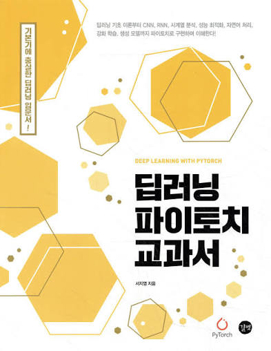

# Deep learning_pytorch


```markdown
# Machine Learning II — Course Projects

This repository contains implementations and experiments
completed during the **Machine Learning II** course in my final semester.

**Python | Scikit-learn | PyTorch | Google Colab**  
**Mar. 2026 – Jun. 2026**

## Overview

Implemented and evaluated various machine learning and deep learning
algorithms, including KNN, SVM, DBSCAN, CNN, and LeNet-5.

## Projects

### 1. KNN
- Implemented K-Nearest Neighbors classification.
- Performed data preprocessing and model evaluation.

### 2. SVM
- Implemented Support Vector Machine classification.
- Evaluated classification performance.

### 3. DBSCAN
- Applied density-based clustering.
- Analyzed clustering results.

### 4. CNN & LeNet-5
- Implemented convolutional neural networks using PyTorch.
- Trained and evaluated image classification models.
